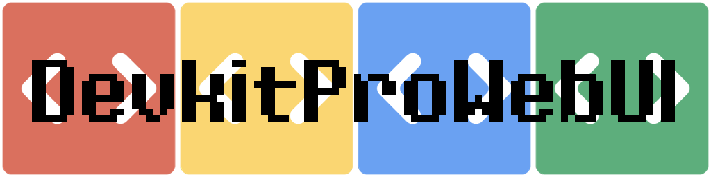
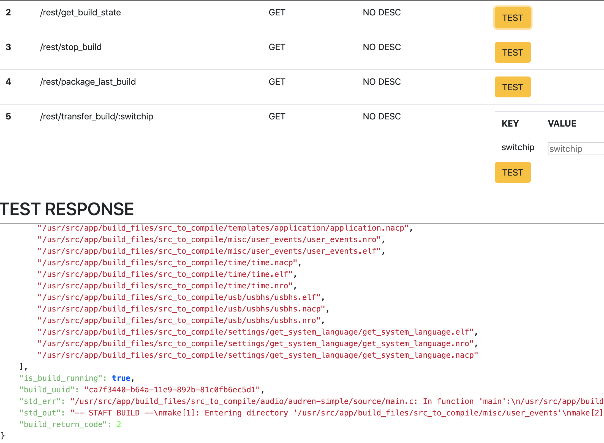

 
# DevkitProWebUI

This api supports the build of nintendo switch homebrew using devkitpro.
You can trigger builds and transfer the output files to your switch using a simple rest api.
The system is designed for an esay integration in CI systems.

# PLACE YOUR SOUCE
Copy your sourcefile including a Makefile in the `/src/app/build_files/src_to_compile` Folder.
The main Makefile must be placed in the root of the `src_to_compile`-Folder.
This makefile will be called at a build request. Any other Makefile will be ignored.
You can edit the build scrip to your needs `run_build.sh`, but a rebuild of the image is required.

# TRIGGER A BUILD
If you or your build system placed the source files in the folder, you can trigger the build.

* `DOCKER_IP:3015/rest/trigger_build` - START THE BBUILD
* `DOCKER_IP:3015/rest/get_build_state` - RETURNS IF THE BUILD IS RUNNING AND GET THE STDOUT/STDERR

# VIEW RESULT
The `DOCKER_IP:3015/rest/get_build_state` request returns a `is_build_running` attribute.
If the state changes to `flase` and the `err` attribute is not set the build is finised.
A list of build files can be found in the `last_build_files` attribute.

# PACKAGE
The `DOCKER_IP:3015/rest/package_last_build` enpoints creates a zip archive from the last build.
The file can be found in the `/src/app/build_files/archive_dir`-Folder

# TRANSFER NRO
To transfer the build this tool using `nxlink` to copy the nro file via the network to the switch.
To upload the `.nro` file from the last build to you switch call `DOCKER_IP:3015/rest/transfer_build/SWITCH_IP`.

# BUILD THE IMAGE
`$ docker build -t devkitprowebui .`
# RUN THE IMAGE`
 `$ docker run -p 3015:3015 -v "$(pwd)/app/build_files:/usr/src/app/build_files" devkitprowebui`

# ALL API CALLS
